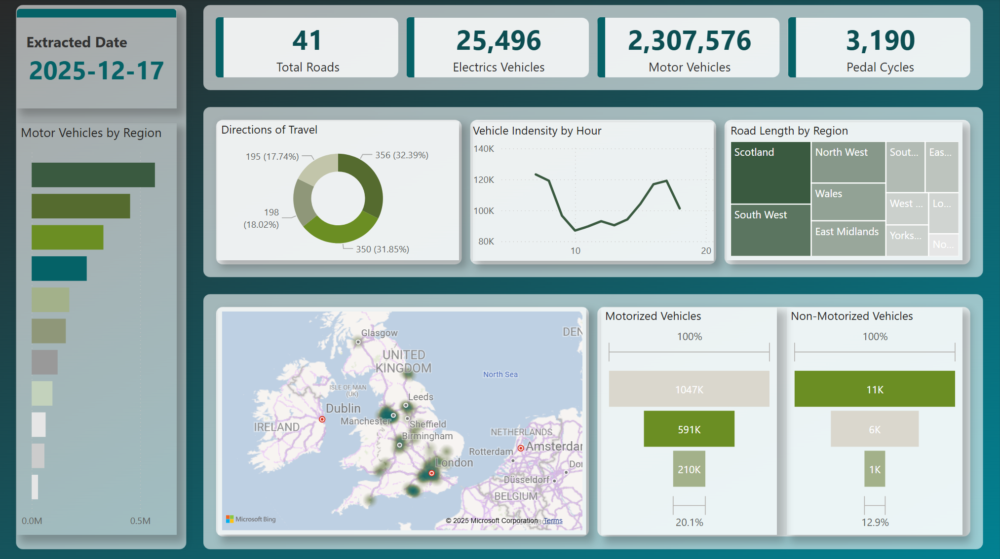

# Traffic Data ETL Pipeline on Azure Databricks

A production-ready ETL pipeline for processing traffic and road data using Azure Databricks, implementing the Medallion Architecture (Bronze-Silver-Gold) with data quality validation.

## Table of Contents

- [Project Architecture](#project-architecture)
- [Dashboard](#dashboard)
- [Overview](#overview)
- [Data Flow](#data-flow)
- [Technical Highlights](#technical-highlights)
- [Project Structure](#project-structure)
- [Pipeline Stages](#pipeline-stages)
- [Data Quality](#data-quality)
- [Setup & Execution](#setup--execution)

## Project Architecture


## Dashboard



## Overview

This project implements an end-to-end ETL pipeline for traffic analytics on Azure, processing vehicle count data and road information through multiple transformation layers. The pipeline uses **Spark Structured Streaming** for real-time data ingestion and **Delta Lake** for ACID transactions and time travel capabilities.

## Data Flow

```
Landing Zone (CSV) 
    ↓
Bronze Layer (Raw Data)
    ↓ [Data Quality Validation]
Silver Layer (Cleaned & Enriched)
    ↓ [Business Logic]
Gold Layer (Analytical Ready)
    ↓
Power BI Dashboard
```

### Data Sources
- **Raw Traffic Data**: Vehicle counts by type, location, time, and road segments
- **Raw Roads Data**: Road categories, regions, link lengths, and motor vehicle statistics

## Technical Highlights

### Core Technologies
- **Azure Databricks**: Unified analytics platform
- **Apache Spark**: Distributed data processing with Structured Streaming
- **Delta Lake**: ACID transactions, schema evolution, time travel
- **Great Expectations**: Data quality validation framework
- **Azure Data Lake Storage (ADLS)**: Scalable data storage
- **Unity Catalog**: Centralized data governance

### Key Features
- **Medallion Architecture**: Bronze → Silver → Gold data layers
- **Streaming Processing**: Real-time data ingestion with checkpointing
- **Data Quality**: Automated validation with quarantine mechanism
- **Multi-Environment Support**: Dev, UAT, and Production configurations
- **Schema Evolution**: Automatic schema merging and validation
- **Error Handling**: Failed records quarantined for review

## Project Structure

```
Azure_git/
├── adls/                          # Azure Data Lake Storage structure
│   ├── landing/                   # Raw CSV files landing zone
│   │   ├── raw_roads/
│   │   └── raw_traffic/
│   ├── medallion/
│   │   ├── bronze/                # Raw data layer
│   │   ├── silver/                 # Cleaned & enriched layer
│   │   └── gold/                   # Analytical layer
│   └── checkpoints/               # Streaming checkpoints
├── databricks_traffic/            # Databricks notebooks
│   ├── 01_project_setup.ipynb
│   ├── 02_load_to_bronze.ipynb
│   ├── 03_silver_traffic_tranformation.ipynb
│   ├── 04_common.ipynb
│   ├── 05_silver_roads_transformation.ipynb
│   ├── 06_gold_final_transformation_and_load.ipynb
│   ├── 07_monitor_dashboad.ipynb
│   ├── great_expectations_common.py
│   └── great_expectations_setting.ipynb
├── dataset/                       # Sample data files
│   ├── raw_roads/
│   └── raw_traffic/
└── report/                        # Analytics reports
    ├── sample/
    └── traffic_analysis_report.pbix
```

## Pipeline Stages

This pipeline implements production best practices including error handling, data quality validation, and multi-environment support for scalable traffic data analytics on Azure.

### 1. Project Setup (`01_project_setup.ipynb`)
- Environment configuration (dev/uat/prod)
- Database and table creation
- Delta table definitions for Bronze layer
- Cleanup utilities

**Key Operations:**
- Creates Unity Catalog database
- Defines `raw_traffic` and `raw_roads` Delta tables
- Configures external locations and paths

### 2. Bronze Layer (`02_load_to_bronze.ipynb`)
- Streams CSV files from landing zone
- Applies schema validation
- Runs Great Expectations data quality checks
- Writes to Bronze Delta tables

**Transformations:**
- Schema enforcement
- Header validation
- Data type conversion
- Extract timestamp addition

**Data Quality Rules:**
- Column presence validation
- Null checks
- Date format validation
- Value range checks

### 3. Silver Layer - Traffic (`03_silver_traffic_tranformation.ipynb`)
- Reads from Bronze `raw_traffic` table
- Data cleaning and enrichment

**Transformations:**
- Duplicate removal
- Null value handling (string → 'Unknown', numeric → 0)
- **Calculated Columns:**
  - `Electrics_Vehicles_Count` = EV_Car + EV_Bike
  - `Motor_Vehicles_Count` = Sum of all vehicle types
  - `Transformed_Time` = Processing timestamp

### 4. Common Functions (`04_common.ipynb`)
- Shared utility functions
- Path configurations
- Data quality helpers

**Functions:**
- `check_duplicates()`: Removes duplicate records
- `check_null()`: Handles null values by data type

### 5. Silver Layer - Roads (`05_silver_roads_transformation.ipynb`)
- Processes Bronze `raw_roads` table
- Adds business logic classifications

**Transformations:**
- Duplicate and null handling
- **Road Category Mapping:**
  - TA → Class A Trunk Road
  - TM → Class A Trunk Motor
  - PA → Class A Principal Road
  - PM → Class A Principal Motorway
  - M → Class B Road
- **Road Type Classification:**
  - Class A → Major
  - Class B → Minor

### 6. Gold Layer (`06_gold_final_transformation_and_load.ipynb`)
- Final analytical transformations
- Joins traffic and roads data
- Calculates business metrics

**Transformations:**
- **Vehicle Intensity Calculation:**
  - `Vehicle_Indensity` = Motor_Vehicles_Count / Link_length_km
- Loading timestamp addition
- Final aggregation and enrichment

### 7. Monitoring Dashboard (`07_monitor_dashboad.ipynb`)
- Pipeline health monitoring
- Record count validation across layers
- Data quality metrics
- Quarantine table monitoring

## Data Quality

### Great Expectations Integration
- **Validation Framework**: Automated data quality checks
- **Quarantine Mechanism**: Failed records stored in `data_quality_quarantine` table
- **Thread-Safe Processing**: Serial queue mode for batch validation
- **Expectation Suites**: Reusable validation rules per table

### Validation Rules
**Raw Traffic:**
- Required columns present
- Record_ID not null
- Date format validation (dd/mm/yyyy HH:mm)
- Hour range (1-24)
- Road category ID range (1-5)

**Raw Roads:**
- Required columns present
- Road_ID not null
- Link length >= 0
- Road category ID range (1-5)

### Error Handling
- Failed validations → Quarantine table
- Validation errors → Full batch insertion (graceful degradation)
- Detailed error tracking with violated rules

## Setup & Execution

### Prerequisites
- Azure Databricks workspace
- Unity Catalog configured
- External location for ADLS
- Great Expectations library installed

### Execution Order
1. **Setup**: Run `01_project_setup.ipynb` to initialize environment
2. **Great Expectations**: Configure validation suites in `great_expectations_setting.ipynb`
3. **Bronze**: Execute `02_load_to_bronze.ipynb` to load raw data
4. **Silver Traffic**: Run `03_silver_traffic_tranformation.ipynb`
5. **Silver Roads**: Run `05_silver_roads_transformation.ipynb`
6. **Gold**: Execute `06_gold_final_transformation_and_load.ipynb`
7. **Monitor**: Use `07_monitor_dashboad.ipynb` for pipeline health

### Environment Configuration
- Select environment via widget: `dev`, `uat`, or `prod`
- Paths and catalog names automatically configured
- Checkpoints maintained per environment

### Key Configuration Variables
```python
catalog_url = # External location URL
landing_url = # CSV landing zone
bronze_url = # Bronze layer storage
silver_url = # Silver layer storage
gold_url = # Gold layer storage
checkpoint_url = # Streaming checkpoints
db_name = "traffic_db"
```

---

